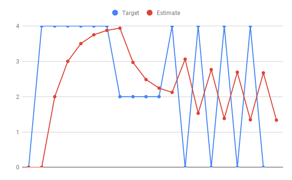
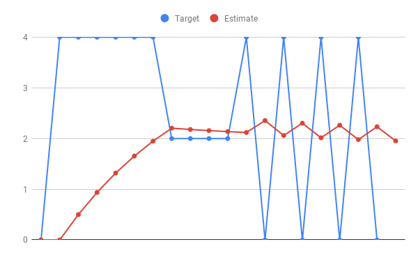
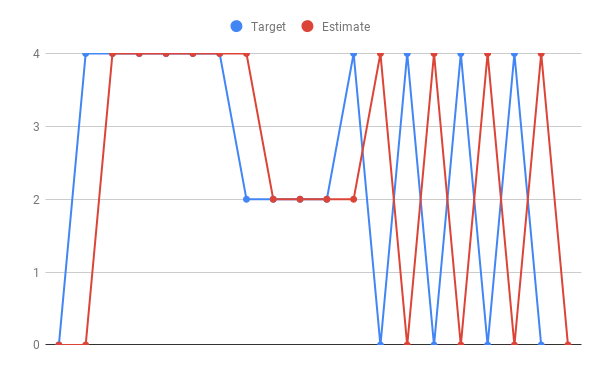
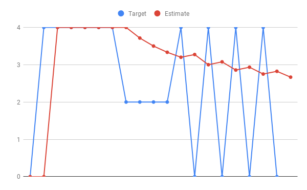
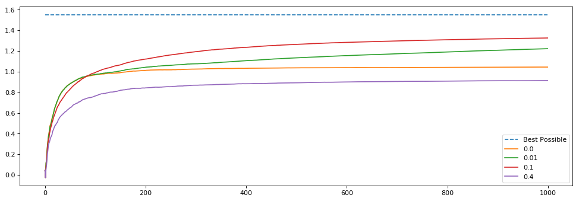

### 1. 
What is the incremental rule (sample average) for action values?

- $Q_{n+1}= Q_n + \frac{1}{n} [R_n + Q_n]$

- $Q_{n+1}= Q_n - \frac{1}{n} [R_n - Q_n]$

- $Q_{n+1}= Q_n + \frac{1}{n} [Q_n]$

- $Q_{n+1}= Q_n + \frac{1}{n} [R_n - Q_n]$

Click to reveal answer

Answer: $Q_{n+1}= Q_n + \frac{1}{n} [R_n - Q_n]$

At each time step the agent moves its prediction in the direction of the error by the step size (here $\frac{1}{n}$).

---

### 2. 

Equation 2.5 (from the SB textbook, 2nd edition) is a key update rule we will use throughout the Specialization. We discussed this equation extensively in [this video](https://www.coursera.org/learn/fundamentals-of-reinforcement-learning/lecture/XWqhe/estimating-action-values-incrementally). This exercise will give you a better hands-on feel for how it works. 

$q_{n+1} = q_n + \alpha_n [R_n - q_n]$

Given the estimate update in red, what do you think was the value of the step size parameter we used to update the estimate on each time step?

- 1.0
- 1/2
- 1/8
- 1/(t-1)

Click to reveal answer

Answer: $\frac{1}{2}$

We can see that the estimate is updated by about half of what the prediction error is.

---

### 3.

Equation 2.5 (from the SB textbook, 2nd edition) is a key update rule we will use throughout the Specialization. We discussed this equation extensively in [video](https://www.coursera.org/learn/fundamentals-of-reinforcement-learning/lecture/XWqhe/estimating-action-values-incrementally "video"). This exercise will give you a better hands-on feel for how it works. The blue line is the target that we might estimate with equation 2.5. The red line is our estimate plotted over time.

$$q_{n+1}=q_n+\alpha_n[R_n-q_n]$$

Given the estimate update in red, what do you think was the value of the step size parameter we used to update the estimate on each time step?

1. 1.0
2. 1/(t-1)
3. 1/2
4. 1/8

Click to reveal answer

Answer: 1/8

We can see that the estimate is updated by $\frac{1}{8}$ of the prediction error at each time step.

---

### 4.

Question 4: 

Equation 2.5 (from the SB textbook, 2nd edition) is a key update rule we will use throughout the Specialization. We discussed this equation extensively in [video](https://www.coursera.org/learn/fundamentals-of-reinforcement-learning/lecture/XWqhe/estimating-action-values-incrementally). This exercise will give you a better hands-on feel for how it works. 

The blue line is the target that we might estimate with equation 2.5. The red line is our estimate plotted over time.

$$q_{n+1} = q_n + \alpha_n[R_n - q_n]$$

Given the estimate update in red, what do you think was the value of the step size parameter we used to update the estimate on each time step?

- 1/2
- 1.0
- 1/8
- 1/(t-1)

Click to reveal answer

Answer: 1,0

The estimate is updated to what the previous target was.

---
### 5.

Equation 2.5 (from the SB textbook, 2nd edition) is a key update rule we will use throughout the Specialization. We discussed this equation extensively in [video](https://www.coursera.org/learn/fundamentals-of-reinforcement-learning/lecture/XWqhe/estimating-action-values-incrementally "video"). This exercise will give you a better hands-on feel for how it works. The blue line is the target that we might estimate with equation 2.5. The red line is our estimate plotted over time.

$q_{n+1} = q_n + \alpha_n [R_n - q_n]$ 

Given the estimate update in red, what do you think was the value of the step size parameter we used to update the estimate on each time step?

- 1.0
- 1/2
- 1/8
- 1/(t-1)

Click to reveal answer

Answer: 1/(t-1)

We can see that the estimate is updated fully to the target initially, and then over time the amount that the estimate updates is reduced. This indicates that our step size is reducing over time

---
### 6.

What is the exploration/exploitation tradeoff?

- The agent wants to explore to get more accurate estimates of its values. The agent also wants to exploit to get more reward. The agent cannot, however, choose to do both simultaneously.
- The agent wants to explore the environment to learn as much about it as possible about the various actions. That way once it knows every arm’s true value it can choose the best one for the rest of the time.
- The agent wants to maximize the amount of reward it receives over its lifetime. To do so it needs to avoid the action it believes is worst to exploit what it knows about the environment. However to discover which arm is truly worst it needs to explore different actions which potentially will lead it to take the worst action at times.

Click to reveal answer

Answer: 

> The agent wants to explore to get more accurate estimates of its values. The agent also wants to exploit to get more reward. The agent cannot, however, choose to do both simultaneously.

The agent wants to maximize the amount of reward it receives over time, but needs to explore to find the right action.

---

### 7.

Why did epsilon of 0.1 perform better over 1000 steps than epsilon of 0.01?

- The 0.01 agent did not explore enough. Thus it ended up selecting a suboptimal arm for longer.
- The 0.01 agent explored too much causing the arm to choose a bad action too often.
- Epsilon of 0.1 is the optimal value for epsilon in general.

Click to reveal answer

Answer: 

> The 0.01 agent did not explore enough. Thus it ended up selecting a suboptimal arm for longer.

The agent needs to be able to explore enough to be able to find the best arm to pull over time. Here epsilon of 0.01 does not allow for enough exploration in the time allotted.

---

### 8.

If exploration is so great why did epsilon of 0.0 (a greedy agent) perform better than epsilon of 0.4?

- Epsilon of 0.4 doesn’t explore often enough to find the optimal action.
- Epsilon of 0.4 explores too often that it takes many sub-optimal actions causing it to do worse over the long term.
- Epsilon of 0.0 is greedy, thus it will always choose the optimal arm.

Click to reveal answer

Answer: 

> Epsilon of 0.4 explores too often that it takes many sub-optimal actions causing it to do worse over the long term.

While we want to explore to find the best arm, if we explore too much we can spend too much time choosing bad actions even when we know the correct one. In this case the action-value estimates are likely correct, however the policy does not always choose the action with the highest value.

